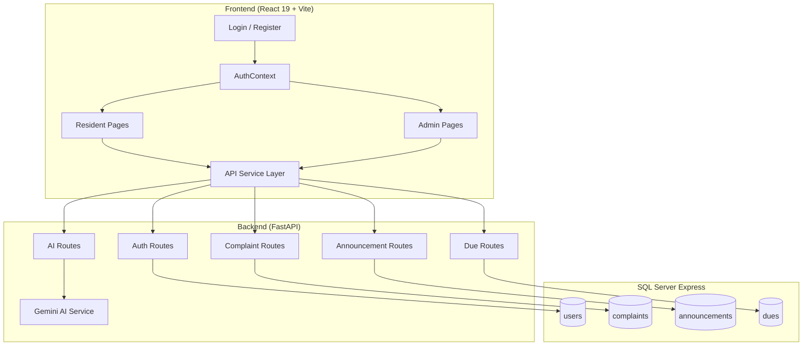
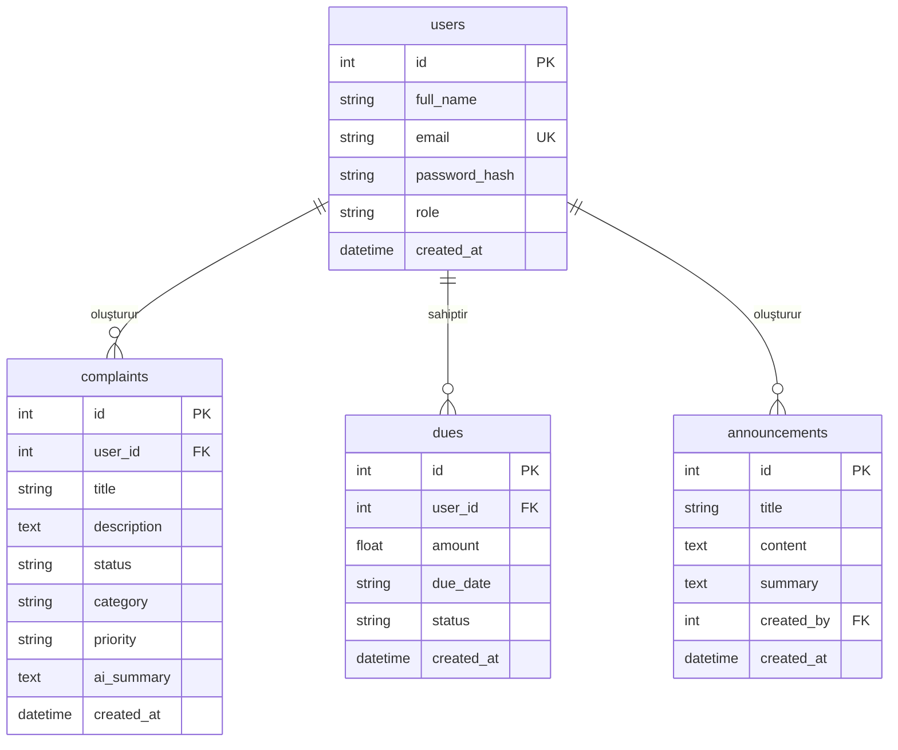

# APT.AI — Proje Durum Raporu

> **Tarih:** 5 Mayıs 2026  
> **Proje:** APT.AI — Apartman & Site Yönetim Sistemi  
> **Teknolojiler:** FastAPI (Python 3.11) + React 19 (Vite 8) + SQL Server Express + Gemini AI

---

## 1. Proje Mimarisi



---

## 2. Yapılanlar (Mevcut Durum)

### ✅ Backend — Tamamlanan Özellikler

| Modül | Dosya | Durum | Açıklama |
|-------|-------|-------|----------|
| **Veritabanı** | [session.py](file:///c:/Users/nesli/APT-AI/backend/app/db/session.py) | ✅ Çalışıyor | SQL Server Express + SQLAlchemy + pyodbc bağlantısı |
| **Modeller** | [user.py](file:///c:/Users/nesli/APT-AI/backend/app/models/user.py) | ✅ Çalışıyor | `users` tablosu (id, full_name, email, password_hash, role, created_at) |
| **Modeller** | [complaint.py](file:///c:/Users/nesli/APT-AI/backend/app/models/complaint.py) | ✅ Çalışıyor | `complaints` tablosu (id, user_id, title, description, status, category, priority, ai_summary, created_at) |
| **Modeller** | [announcement.py](file:///c:/Users/nesli/APT-AI/backend/app/models/announcement.py) | ✅ Çalışıyor | `announcements` tablosu (id, title, content, summary, created_by, created_at) |
| **Modeller** | [due.py](file:///c:/Users/nesli/APT-AI/backend/app/models/due.py) | ✅ Çalışıyor | `dues` tablosu (id, user_id, amount, due_date, status, created_at) |
| **Auth** | [auth.py](file:///c:/Users/nesli/APT-AI/backend/app/routes/auth.py) | ✅ Çalışıyor | Kayıt (`/auth/register`), Giriş (`/auth/login`), Profil (`/auth/me`), Kullanıcı listesi (`/auth/users`) |
| **Güvenlik** | [security.py](file:///c:/Users/nesli/APT-AI/backend/app/core/security.py) | ✅ Çalışıyor | bcrypt şifreleme, JWT token üretimi (python-jose) |
| **Yetkilendirme** | [deps.py](file:///c:/Users/nesli/APT-AI/backend/app/db/deps.py) | ✅ Çalışıyor | Bearer token doğrulama, `get_current_user`, `get_current_admin` |
| **Şikayetler** | [complaints.py](file:///c:/Users/nesli/APT-AI/backend/app/routes/complaints.py) | ✅ Çalışıyor | CRUD + AI analiz (POST, GET /my, GET all, PUT status) |
| **Duyurular** | [announcements.py](file:///c:/Users/nesli/APT-AI/backend/app/routes/announcements.py) | ✅ Çalışıyor | GET listele + POST oluştur (AI özet ile) |
| **Aidatlar** | [dues.py](file:///c:/Users/nesli/APT-AI/backend/app/routes/dues.py) | ✅ Çalışıyor | GET /my, GET all, POST, PUT status |
| **AI Servis** | [ai_service.py](file:///c:/Users/nesli/APT-AI/backend/app/services/ai_service.py) | ✅ Çalışıyor | Gemini 1.5 Flash: şikayet analizi, duyuru özeti, dashboard insights |
| **Startup** | [main.py](file:///c:/Users/nesli/APT-AI/backend/app/main.py) | ✅ Çalışıyor | Lifespan DB bağlantı kontrolü + tablo oluşturma + CORS |

### ✅ Frontend — Tamamlanan Özellikler

| Sayfa | Dosya | Durum | Açıklama |
|-------|-------|-------|----------|
| **Login** | [Login.jsx](file:///c:/Users/nesli/APT-AI/frontend/src/pages/auth/Login.jsx) | ✅ Çalışıyor | E-posta/şifre ile giriş, hata mesajları, backend'e bağlı |
| **Register** | [Register.jsx](file:///c:/Users/nesli/APT-AI/frontend/src/pages/auth/Register.jsx) | ✅ Çalışıyor | Kayıt formu (ad, e-posta, şifre, rol seçimi), backend'e bağlı |
| **Auth Context** | [AuthContext.jsx](file:///c:/Users/nesli/APT-AI/frontend/src/context/AuthContext.jsx) | ✅ Çalışıyor | localStorage'da user/token yönetimi |
| **Sakin Dashboard** | [Dashboard.jsx](file:///c:/Users/nesli/APT-AI/frontend/src/pages/resident/Dashboard.jsx) | ⚠️ Kısmen | Statik/hardcoded veriler gösteriyor (500 TL, 1 şikayet) — API'ye bağlı değil |
| **Duyurular** | [Announcements.jsx](file:///c:/Users/nesli/APT-AI/frontend/src/pages/resident/Announcements.jsx) | ✅ Çalışıyor | Backend'den duyuru listesi çekiyor |
| **Şikayetlerim** | [Complaints.jsx](file:///c:/Users/nesli/APT-AI/frontend/src/pages/resident/Complaints.jsx) | ✅ Çalışıyor | Backend'den kendi şikayetlerini çekiyor |
| **Yeni Şikayet** | [ComplaintNew.jsx](file:///c:/Users/nesli/APT-AI/frontend/src/pages/resident/ComplaintNew.jsx) | ✅ Çalışıyor | Form → backend POST → AI analiz |
| **Aidatlarım** | [Dues.jsx](file:///c:/Users/nesli/APT-AI/frontend/src/pages/resident/Dues.jsx) | ✅ Çalışıyor | Backend'den aidat listesi çekiyor |
| **Profil** | [Profile.jsx](file:///c:/Users/nesli/APT-AI/frontend/src/pages/resident/Profile.jsx) | ✅ Çalışıyor | AuthContext'ten kullanıcı bilgisi gösteriyor |
| **Admin Dashboard** | [AdminDashboard.jsx](file:///c:/Users/nesli/APT-AI/frontend/src/pages/admin/AdminDashboard.jsx) | ⚠️ Kısmen | Statik/hardcoded veriler (15 şikayet, 24 sakin) — API'ye bağlı değil |
| **Admin Şikayetler** | [AdminComplaints.jsx](file:///c:/Users/nesli/APT-AI/frontend/src/pages/admin/AdminComplaints.jsx) | ✅ Çalışıyor | Tablo + durum güncelleme |
| **Admin Duyurular** | [AdminAnnouncements.jsx](file:///c:/Users/nesli/APT-AI/frontend/src/pages/admin/AdminAnnouncements.jsx) | ⚠️ Kısmen | Listeleme çalışıyor ama "Yeni Duyuru Ekle" butonu fonksiyonsuz |
| **Admin Aidatlar** | [AdminDues.jsx](file:///c:/Users/nesli/APT-AI/frontend/src/pages/admin/AdminDues.jsx) | ⚠️ Kısmen | Listeleme çalışıyor ama "Aidat Ekle" butonu fonksiyonsuz |
| **Kullanıcı Listesi** | [AdminUsers.jsx](file:///c:/Users/nesli/APT-AI/frontend/src/pages/admin/AdminUsers.jsx) | ✅ Çalışıyor | Backend'den kullanıcı listesi çekiyor |
| **AI Analiz** | [AIInsights.jsx](file:///c:/Users/nesli/APT-AI/frontend/src/pages/admin/AIInsights.jsx) | ✅ Çalışıyor | Gemini AI'dan özet, tekrar eden sorunlar, öneriler |

### ✅ Altyapı

| Özellik | Durum | Açıklama |
|---------|-------|----------|
| Routing (React Router v7) | ✅ | Auth, Resident, Admin rotaları tanımlı |
| ProtectedRoute | ✅ | Giriş yapmamış → /login, yetki yok → /dashboard |
| CORS | ✅ | `allow_origins=["*"]` — tüm originlere açık |
| Sidebar Navigasyon | ✅ | Rol bazlı (admin vs resident) menü |
| JWT Authentication | ✅ | Backend'de token üretimi, frontend'de interceptor ile gönderim |
| Auto Table Creation | ✅ | Uygulama başlarken tablolar otomatik oluşturuluyor |

---

## 3. Çözülen Hatalar (Bu Oturumda)

### 🔧 Hata 1: "Cannot find module `fastapi`" (IDE Hatası)

**Sebep:** Proje kök dizininde (`APT-AI/`) boş bir `.venv` ve `.venv-1` klasörü bulunuyordu. VS Code / Pylance bu boş ortamı kullanıyordu, fakat FastAPI paketleri aslında `backend/.venv` içinde yüklüydü.

**Çözüm:**
1. Kök dizindeki gereksiz `.venv` ve `.venv-1` klasörleri **silindi**
2. `.vscode/settings.json` dosyası oluşturuldu — doğru interpreter yolu ayarlandı
3. `pyrightconfig.json` dosyası oluşturuldu — Pylance'a doğru venv gösterildi

**Eklenen dosyalar:**
- [.vscode/settings.json](file:///c:/Users/nesli/APT-AI/.vscode/settings.json) — Python interpreter: `backend/.venv/Scripts/python.exe`
- [pyrightconfig.json](file:///c:/Users/nesli/APT-AI/pyrightconfig.json) — Pyright konfigürasyonu

> [!IMPORTANT]
> VS Code'u **yeniden başlatın** (Ctrl+Shift+P → "Reload Window") ki yeni ayarlar yüklensin. Artık her bilgisayar açılışında bu hata görünmeyecek.

---

## 4. Eksiklikler ve Sorunlar

### 🔴 Kritik Eksiklikler

| # | Eksiklik | Açıklama | Etkilenen Dosya(lar) |
|---|----------|----------|---------------------|
| 1 | **Dashboard sayfaları statik** | Sakin ve Admin dashboard'lar hardcoded veriler gösteriyor (500 TL, 15 şikayet vb.) — Backend'den gerçek veriler çekilmiyor | [Dashboard.jsx](file:///c:/Users/nesli/APT-AI/frontend/src/pages/resident/Dashboard.jsx), [AdminDashboard.jsx](file:///c:/Users/nesli/APT-AI/frontend/src/pages/admin/AdminDashboard.jsx) |
| 2 | **"Yeni Duyuru Ekle" butonu çalışmıyor** | Buton var ama hiçbir fonksiyona bağlı değil — form/modal yok | [AdminAnnouncements.jsx](file:///c:/Users/nesli/APT-AI/frontend/src/pages/admin/AdminAnnouncements.jsx) |
| 3 | **"Aidat Ekle" butonu çalışmıyor** | Buton var ama hiçbir fonksiyona bağlı değil — form/modal yok | [AdminDues.jsx](file:///c:/Users/nesli/APT-AI/frontend/src/pages/admin/AdminDues.jsx) |
| 4 | **"Düzenle" butonları çalışmıyor** | Admin Duyuru ve Aidat tablolarında "Düzenle" butonları fonksiyonsuz | [AdminAnnouncements.jsx](file:///c:/Users/nesli/APT-AI/frontend/src/pages/admin/AdminAnnouncements.jsx), [AdminDues.jsx](file:///c:/Users/nesli/APT-AI/frontend/src/pages/admin/AdminDues.jsx) |
| 5 | **Aidat durumu güncelleme yok** | Admin aidatlar sayfasında durum değiştirme (ödendi/ödenmedi) mekanizması yok — backend endpoint var ama frontend bağlı değil | [AdminDues.jsx](file:///c:/Users/nesli/APT-AI/frontend/src/pages/admin/AdminDues.jsx) |

### 🟡 Orta Düzey Eksiklikler

| # | Eksiklik | Açıklama |
|---|----------|----------|
| 6 | **Hata yönetimi yetersiz** | Birçok sayfada `.catch()` yok veya sadece `console.error` var — kullanıcıya hata mesajı gösterilmiyor |
| 7 | **Loading durumları eksik** | Çoğu sayfada veri yüklenirken "Yükleniyor..." gösterimi yok (AdminUsers ve AIInsights hariç) |
| 8 | **Boş durum (empty state) yok** | Liste sayfaları boş olduğunda kullanıcıya bilgi vermiyor |
| 9 | **Şikayet silme özelliği yok** | Ne backend ne frontend'de şikayet silme endpoint'i var |
| 10 | **Duyuru silme özelliği yok** | Ne backend ne frontend'de duyuru silme endpoint'i var |
| 11 | **Aidat silme özelliği yok** | Aynı şekilde aidat silme yok |
| 12 | **Kullanıcı silme/düzenleme yok** | Admin kullanıcı listesi sadece read-only |
| 13 | **`google.generativeai` paketi deprecated** | Her backend başlatmada `FutureWarning` veriyor — `google.genai` paketine geçilmeli |
| 14 | **Gereksiz `app/deps.py` dosyası** | Kök `app/` dizininde eski bir [deps.py](file:///c:/Users/nesli/APT-AI/backend/app/deps.py) var, gerçek dosya [db/deps.py](file:///c:/Users/nesli/APT-AI/backend/app/db/deps.py) |
| 15 | **Tarih formatlaması yok** | Tablolarda `created_at` ISO 8601 formatında ham gösteriliyor (ör: `2026-05-05T10:55:52.021311`) |

### 🟢 İyileştirme Önerileri

| # | Öneri | Açıklama |
|---|-------|----------|
| 16 | **Token yenileme (refresh token) yok** | Mevcut JWT 60 dk sonra expire oluyor, kullanıcı tekrar giriş yapmak zorunda |
| 17 | **Şifre değiştirme sayfası yok** | Profil sayfasında sadece bilgiler gösteriliyor, düzenleme yok |
| 18 | **Bildirim sistemi yok** | Yeni duyuru/şikayet geldiğinde bildirim mekanizması yok |
| 19 | **Arama/filtreleme yok** | Şikayet ve aidat listelerinde arama/filtreleme özelliği yok |
| 20 | **Sayfalama (pagination) yok** | Büyük veri setlerinde tüm veriler tek seferde çekiliyor |
| 21 | **Responsive tasarım eksik** | Sidebar mobilde gizlenmiyor, hamburger menü yok |
| 22 | **Dark mode yok** | Sadece light tema var |
| 23 | **Dosya yükleme yok** | Şikayetlere fotoğraf/dosya ekleme özelliği yok |
| 24 | **`echo=True` üretimde kapatılmalı** | [session.py](file:///c:/Users/nesli/APT-AI/backend/app/db/session.py) L18: SQL logları terminale yazılıyor — performans etkisi |
| 25 | **SECRET_KEY güvensiz** | `.env` dosyasındaki secret key ödev projesi için yeterli ama production için kriptografik rastgele key gerekli |
| 26 | **CORS `allow_origins=["*"]`** | Production'da güvenlik riski — sadece frontend URL'si izin verilmeli |
| 27 | **Kayıt formunda rol seçimi açık** | Herkes "admin" olarak kayıt olabiliyor — production'da kısıtlanmalı |

---

## 5. Dosya Yapısı Özeti

```
APT-AI/
├── .vscode/
│   └── settings.json          ← YENİ: IDE Python interpreter ayarı
├── pyrightconfig.json          ← YENİ: Pylance venv ayarı
│
├── backend/
│   ├── .env                    # DB_SERVER, DB_NAME, GEMINI_API_KEY, SECRET_KEY
│   ├── .venv/                  # Python virtual environment (tüm paketler burada)
│   ├── requirements.txt        # 60+ Python paketi
│   └── app/
│       ├── main.py             # FastAPI app + lifespan + router registration
│       ├── deps.py             # ⚠️ Gereksiz (eski dosya)
│       ├── core/
│       │   └── security.py     # bcrypt + JWT
│       ├── db/
│       │   ├── session.py      # SQLAlchemy engine + SessionLocal
│       │   └── deps.py         # get_current_user, get_current_admin
│       ├── models/
│       │   ├── user.py
│       │   ├── complaint.py
│       │   ├── announcement.py
│       │   └── due.py
│       ├── routes/
│       │   ├── auth.py         # /auth/register, /auth/login, /auth/me, /auth/users
│       │   ├── complaints.py   # CRUD + AI analiz
│       │   ├── announcements.py # GET + POST (AI özet)
│       │   ├── dues.py         # CRUD
│       │   └── ai.py           # /ai/dashboard-insights
│       ├── schemas/
│       │   ├── auth.py         # Pydantic modelleri
│       │   ├── complaint.py
│       │   ├── announcement.py
│       │   └── due.py
│       └── services/
│           └── ai_service.py   # Gemini AI entegrasyonu
│
└── frontend/
    ├── package.json            # React 19 + Vite 8 + axios + lucide-react + react-router-dom
    └── src/
        ├── main.jsx
        ├── App.jsx             # Router tanımları
        ├── index.css           # Global stiller + CSS değişkenleri + utility classes
        ├── context/
        │   └── AuthContext.jsx # Login/logout state yönetimi
        ├── services/
        │   ├── api.js          # Axios instance + token interceptor
        │   ├── authService.js  # login(), register(), logout()
        │   ├── complaintService.js
        │   ├── announcementService.js
        │   ├── dueService.js
        │   └── aiService.js
        ├── components/
        │   ├── ui/             # Badge, Button, Card, Input, Table, Textarea
        │   ├── layout/         # AppLayout, AuthLayout
        │   └── navigation/     # ProtectedRoute, Sidebar
        └── pages/
            ├── auth/           # Login, Register
            ├── resident/       # Dashboard, Announcements, Complaints, ComplaintNew, Dues, Profile
            └── admin/          # AdminDashboard, AdminComplaints, AdminAnnouncements, AdminDues, AdminUsers, AIInsights
```

---

## 6. API Endpoint Özeti

| Method | Endpoint | Yetki | Açıklama |
|--------|----------|-------|----------|
| `POST` | `/auth/register` | Herkese açık | Yeni kullanıcı kaydı |
| `POST` | `/auth/login` | Herkese açık | JWT token ile giriş |
| `GET` | `/auth/me` | Giriş yapmış | Kendi profil bilgisi |
| `GET` | `/auth/users` | Admin | Tüm kullanıcı listesi |
| `POST` | `/complaints` | Giriş yapmış | Şikayet oluştur (+ AI analiz) |
| `GET` | `/complaints/my` | Giriş yapmış | Kendi şikayetleri |
| `GET` | `/complaints` | Admin | Tüm şikayetler |
| `PUT` | `/complaints/{id}/status` | Admin | Şikayet durumu güncelle |
| `GET` | `/announcements` | Giriş yapmış | Duyuru listesi |
| `POST` | `/announcements` | Admin | Duyuru oluştur (+ AI özet) |
| `GET` | `/dues/my` | Giriş yapmış | Kendi aidatları |
| `GET` | `/dues` | Admin | Tüm aidatlar |
| `POST` | `/dues` | Admin | Aidat ekle |
| `PUT` | `/dues/{id}/status` | Admin | Aidat durumu güncelle |
| `GET` | `/ai/dashboard-insights` | Admin | AI analiz raporu |
| `GET` | `/` | Herkese açık | Health check |
| `GET` | `/health` | Herkese açık | Health check |

---

## 7. Veritabanı Şeması



---

## 8. Çalıştırma Talimatları

### Backend
```powershell
cd c:\Users\nesli\APT-AI\backend
.\.venv\Scripts\activate
python -m uvicorn app.main:app --host 0.0.0.0 --port 8000 --reload
```

### Frontend
```powershell
cd c:\Users\nesli\APT-AI\frontend
npm run dev
```

### Ön Koşullar
1. SQL Server Express (`SQLEXPRESS01`) servisinin çalışıyor olması
2. `apt_ai_db` veritabanının var olması (tablolar otomatik oluşturulur)
3. Backend `.venv` içinde tüm paketlerin yüklü olması

---

## 9. Sonuç

APT.AI projesi **temel CRUD işlevleri**, **JWT tabanlı kimlik doğrulama** ve **Gemini AI entegrasyonu** açısından çalışır durumda. Ancak yukarıdaki 27 eksiklik maddesi düzeltilmeden **production-ready** kabul edilemez. En kritik eksiklikler:

1. Dashboard sayfalarının statik olması
2. Admin form butonlarının (Duyuru Ekle, Aidat Ekle) çalışmaması  
3. Hata yönetimi ve loading state'lerinin eksik olması
4. Deprecated `google.generativeai` paketi

> [!TIP]
> IDE "Cannot find module" hatası artık düzeltildi. VS Code'u yeniden başlatmanız yeterli.
